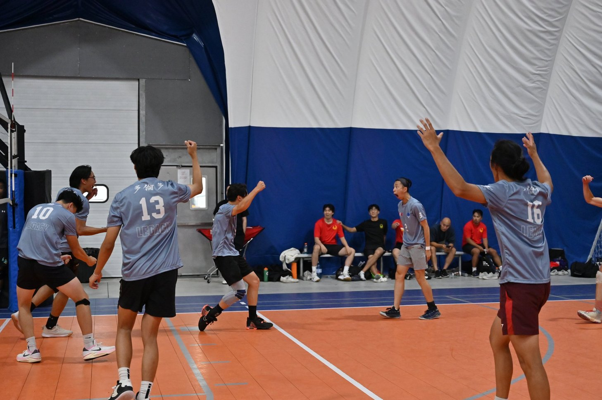
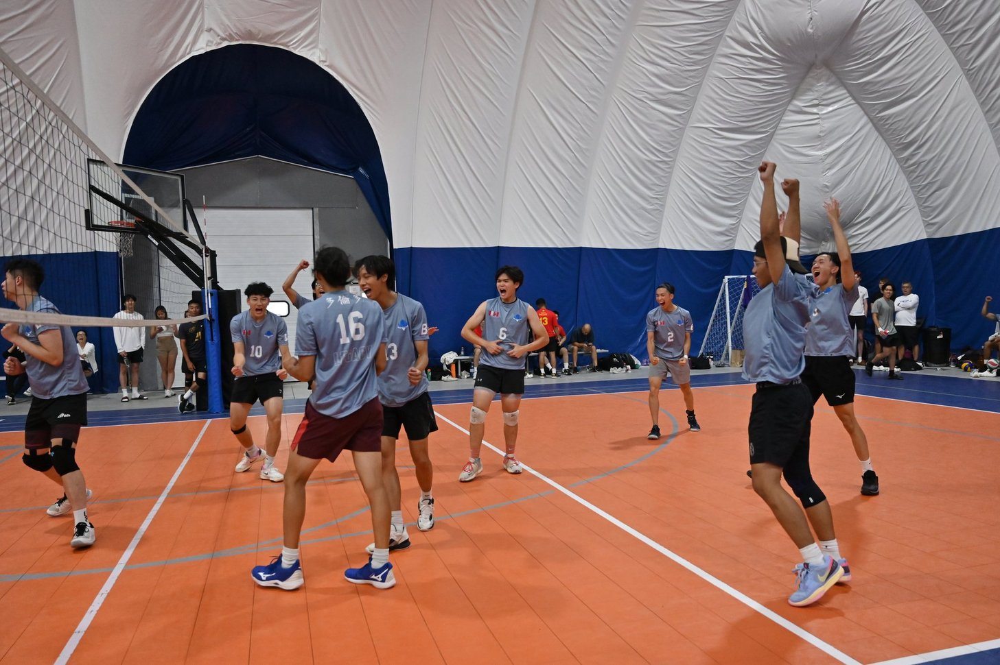
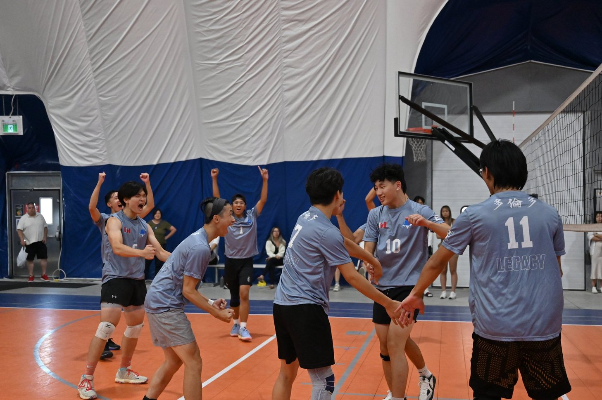
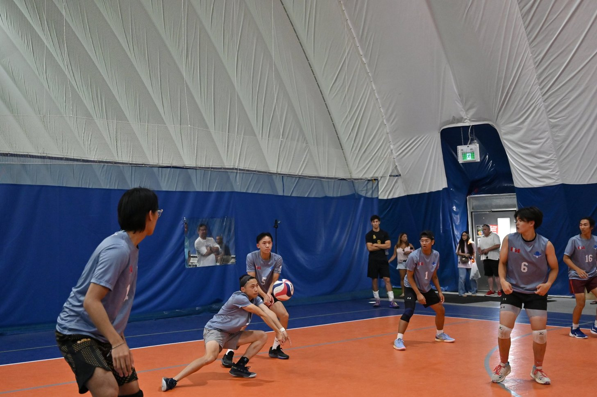

Title: the best sport (ever)
sortorder: 2

As the title suggests, I love playing volleyball! I started playing when I was 12 and the only regret is that I didn't start sooner or play [ova](https://www.ontariovolleyball.org/). I'm primarily self taught (thank you [coach donny](https://www.youtube.com/@elevateyourselfofficial)) and occasionally post to my [volleyball ig](https://www.instagram.com/rshi2vball/) :) 

In the summer of 2023, I tried playing a variation of traditional volleyball (6v6) called [9-man](https://en.wikipedia.org/wiki/9-man), which is like regular volleyball but played with a slightly larger court, 9 players on each side, and modified rules (see [here](https://www.youtube.com/watch?v=mB6hKD9DQho)). The "streetball" style of the sport instantly got me hooked and is one of the things I look forward to every summer.

## gallery

im a very supportive teammate :D

photos taken at the second local 9man tournament of my first season

